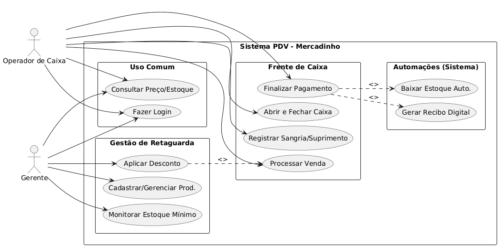
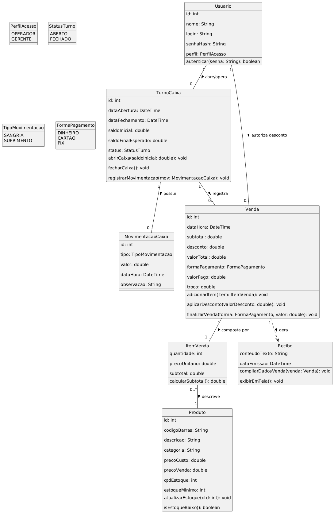
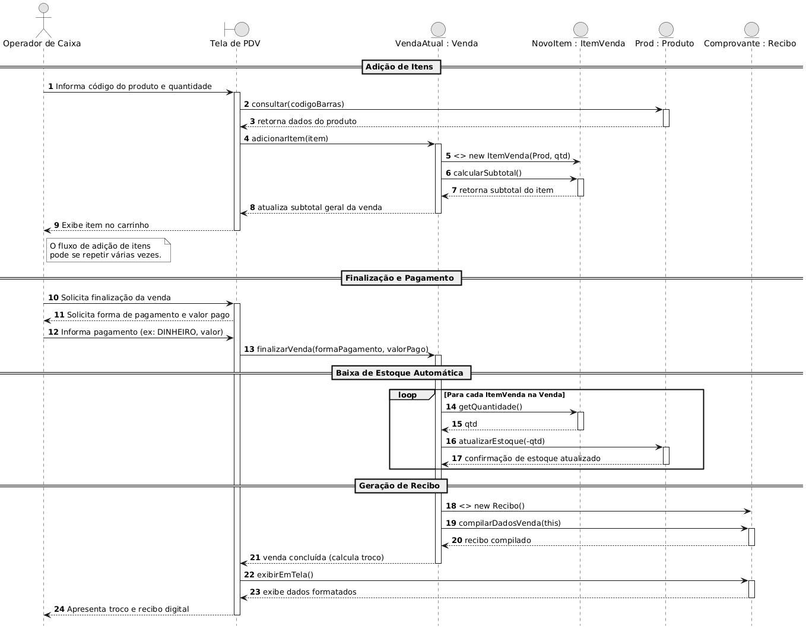
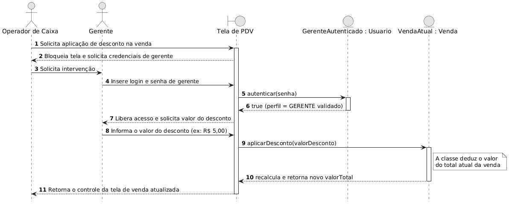

# 🛒 Documentação: Sistema PDV - Mercadinho

Este repositório contém a documentação e modelagem de requisitos e arquitetura para um sistema de Ponto de Venda (PDV) com interface desktop, projetado para o contexto de um pequeno varejo de alimentos ("mercadinho").

**Projeto Acadêmico:** Planejamento e Modelagem de Sistemas.

## 📋 1. Escopo do Projeto

**Visão Geral**
O projeto consiste na especificação e modelagem de um sistema de Ponto de Venda (PDV) com arquitetura desktop. O software é dimensionado para o contexto de um mercadinho, onde a agilidade no caixa e a simplicidade na gestão de estoque são prioridades.

**Objetivo Principal**
Automatizar e registrar as operações diárias de venda, monitorar a entrada e saída de produtos no estoque e fornecer controle básico sobre as movimentações financeiras do caixa.

### 🟢 In-Scope (Dentro do Escopo)

*   **Controle de Estoque:** CRUD de produtos (código, descrição, categoria, preço e quantidade); Atualização automática de estoque pós-venda; Alerta de estoque mínimo.
*   **Fluxo de Caixa:** Abertura/fechamento de turno; Lançamentos avulsos (sangria/suprimento); Processamento de venda (carrinho, subtotais, descontos, troco, forma de pagamento lógica).
*   **Emissão de Recibo:** Geração de comprovante não-fiscal digital exibido em tela.
*   **Gestão de Usuários:** Perfis de *Operador de Caixa* e *Gerente*.

### 🔴 Out-of-Scope (Fora do Escopo)

*   Integração de Hardware (impressoras fiscais, leitores de código de barras).
*   Integração Fiscal/Tributária (NFC-e, SEFAZ).
*   Integração com Gateways de Pagamento (TEF, APIs Bancárias).
*   Gestão de Clientes e Fornecedores (CRM/Crediário).
*   Arquitetura em Nuvem/Distribuída (operação 100% local/offline).

## ⚙️ 2. Requisitos do Sistema

### Requisitos Funcionais (RF)

| ID | Nome do Requisito | Descrição | Ator | Prioridade |
| :--- | :--- | :--- | :--- | :--- |
| **RF01** | **Autenticar Usuário** | Permitir login diferenciando perfis (Gerente e Operador). | Ambos | Alta |
| **RF02** | **Cadastrar Produto** | Registrar produtos com código, nome, categoria, preço e qtd. | Gerente | Alta |
| **RF03** | **Gerenciar Produto** | Editar, consultar e inativar produtos existentes. | Gerente | Alta |
| **RF04** | **Consultar Preço/Estq.** | Busca rápida de itens e visualização da quantidade. | Ambos | Média |
| **RF05** | **Alertar Estoque Mín.** | Sinalizar quando um produto atingir o limite mínimo. | Gerente | Baixa |
| **RF06** | **Abrir/Fechar Caixa** | Registrar o saldo inicial na abertura e final no fechamento. | Operador | Alta |
| **RF07** | **Registrar Mov. Avulsa** | Registrar sangrias (retiradas) e suprimentos (entradas). | Operador | Média |
| **RF08** | **Processar Venda** | Adicionar produtos ao carrinho de uma venda ativa. | Operador | Alta |
| **RF09** | **Aplicar Desconto** | Aplicar descontos no valor total da venda. | Gerente | Baixa |
| **RF10** | **Finalizar Pagamento** | Calcular subtotal, registrar forma de pagamento e troco. | Operador | Alta |
| **RF11** | **Baixar Estoque Auto.** | Deduzir do estoque as quantidades dos itens vendidos. | Sistema | Alta |
| **RF12** | **Gerar Recibo Digital** | Compilar dados da venda em um recibo não-fiscal em tela. | Sistema | Alta |

### Requisitos Não Funcionais (RNF)

| ID | Categoria | Descrição |
| :--- | :--- | :--- |
| **RNF01** | **Plataforma** | Aplicação Desktop, operando localmente. |
| **RNF02** | **Usabilidade** | Interface de caixa otimizada para uso via teclado (atalhos). |
| **RNF03** | **Desempenho** | Tempo de resposta para adição de item < 2 segundos. |
| **RNF04** | **Armazenamento** | Persistência em BD relacional local (ex: MariaDB). |
| **RNF05** | **Disponibilidade** | Funcionamento 100% offline. |
| **RNF06** | **Segurança** | Senhas armazenadas com hash criptográfico. |

## 👤 3. User Stories

### Autenticação e Acesso

*   **US01:** Como um **Operador de Caixa**, eu quero **fazer login** para que **eu possa acessar a frente de caixa e iniciar meu turno**.
*   **US02:** Como um **Gerente**, eu quero **fazer login** para que **eu possa acessar as configurações de retaguarda restritas ao meu perfil**.

### Controle de Estoque

*   **US03:** Como um **Gerente**, eu quero **cadastrar um novo produto** para que **ele passe a compor o catálogo e fique disponível para venda**.
*   **US04:** Como um **Gerente**, eu quero **editar ou inativar o cadastro de um produto** para que **eu possa corrigir erros ou remover itens**.
*   **US05:** Como um **Gerente**, eu quero **visualizar produtos com estoque abaixo da quantidade mínima** para que **eu saiba o que precisa ser comprado**.

### Fluxo de Caixa

*   **US06:** Como um **Operador de Caixa**, eu quero **registrar a abertura do caixa informando o saldo inicial** para que **o sistema calcule o fechamento do meu turno**.
*   **US07:** Como um **Operador de Caixa**, eu quero **inserir produtos na tela de venda atual** para que **eu possa montar o carrinho do cliente**.
*   **US08:** Como um **Gerente**, eu quero **poder aplicar um desconto no valor total de uma venda** para que **eu possa contornar problemas no atendimento**.
*   **US09:** Como um **Operador de Caixa**, eu quero **registrar lançamentos avulsos de suprimento ou sangria** para que **o saldo calculado bata com a gaveta**.
*   **US10:** Como um **Operador de Caixa**, eu quero **informar a forma de pagamento e o valor entregue** para que **o sistema calcule o troco**.
*   **US11:** Como um **Operador de Caixa**, eu quero **realizar o fechamento do caixa ao fim do expediente** para que **eu obtenha o relatório do saldo final**.

### Integrações e Recibo

*   **US12:** Como um **Operador de Caixa**, eu quero **que o sistema dê baixa automática no estoque após o pagamento** para que **o controle seja atualizado em tempo real**.
*   **US13:** Como um **Operador de Caixa**, eu quero **gerar um recibo não-fiscal em tela** para que **eu possa demonstrar e validar os dados da compra com o cliente**.

## 📊 4. Modelagem Visual (UML)

> **Nota:** Para visualizar os diagramas abaixo, certifique-se de que as imagens geradas (.png) estejam salvas na pasta `docs/img/` na raiz do repositório.

### 4.1. Diagrama de Casos de Uso

Demonstra a interação dos atores (Operador e Gerente) com as funcionalidades do sistema.



### 4.2. Diagrama de Classes

Apresenta a estrutura estática do sistema, suas entidades, atributos, métodos e relacionamentos.



### 4.3. Diagrama de Sequência: Venda Completa e Baixa de Estoque

Detalha o fluxo dinâmico da adição de itens, finalização do pagamento, baixa automática no estoque e geração do recibo.



### 4.4. Diagrama de Sequência: Autorização de Desconto

Ilustra o fluxo de exceção onde o Operador solicita uma ação restrita e o Gerente fornece suas credenciais para liberar o desconto.


2.  **Paste the content:** Copy all the text inside the code block above (everything between 
````markdown` and ````) and paste it into the `README.md` file.
3.  **Commit the changes:** Save your changes. GitHub will automatically render this Markdown formatting into the visual layout you are looking for.
4.  **Upload the images:** Remember to create a `docs/img/` folder structure in your repository and upload the `.png` images of your diagrams with the exact names referenced in the file (e.g., `diagrama_casos_uso.png`), otherwise, the image links will be broken.
